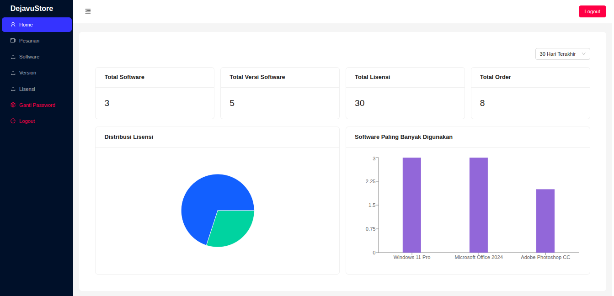
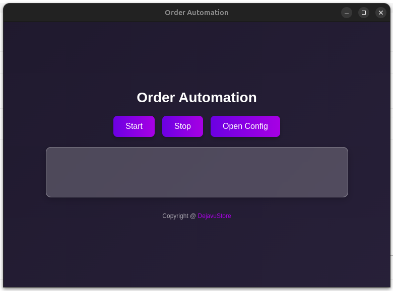

# Order Automation

A desktop automation tool for processing marketplace orders automatically. Built with Electron + Python for the desktop bot, and a Node.js API + React admin dashboard for license management.

## Screenshots

### Admin Dashboard


### Desktop Bot


## Overview

This system automates the process of reading incoming orders from a seller dashboard, matching them to digital products (software licenses), and sending the license keys to customers via automated chat — all without manual intervention.

**How it works:**
1. The desktop bot reads the seller dashboard using OCR (Tesseract) and image recognition (OpenCV)
2. It fetches order data and queries the license API for available keys
3. It sends the license key to the customer via automated chat
4. The admin dashboard provides full visibility into orders, licenses, and software inventory

## Architecture

```
order-automation/
├── main.js              # Electron main process
├── view/                # Desktop UI (HTML + Tailwind CSS)
├── script/              # Python automation scripts
│   ├── main.py          # Core bot — reads orders, sends messages
│   ├── get_data.py      # Fetches order data from API
│   ├── get_cookies.py   # Manages session cookies
│   └── mouse_tracker.py # Mouse coordinate helper for config
├── be/                  # REST API (Node.js + Express + MySQL)
│   ├── controllers/     # Business logic
│   ├── models/          # Sequelize ORM models
│   ├── routes/          # API routes
│   ├── middlewares/     # JWT auth middleware
│   ├── migrations/      # Database migrations
│   └── seeders/         # Database seeders (incl. placeholder data)
├── fe/                  # Admin dashboard (React + Vite + Ant Design)
│   └── src/
│       ├── components/  # Tables, layouts
│       ├── pages/       # Login, change password
│       └── services/    # API client (axios)
├── assets/              # Bot image templates for OCR matching
├── docs/screenshot/     # Project screenshots for documentation
└── data/                # Runtime config and logs (gitignored)
```

## Tech Stack

| Layer | Technology |
|---|---|
| Desktop App | Electron 34 |
| Automation | Python (PyAutoGUI, OpenCV, Tesseract OCR) |
| Backend API | Node.js, Express 4, Sequelize ORM, MySQL |
| Admin Dashboard | React 19, Vite, Ant Design, React Router 7 |
| Auth | JWT (access + refresh token) |
| Database | MySQL 8 (Docker or local) |

## Prerequisites

- Node.js 18+
- Python 3.10+
- MySQL 8+ (or Docker)
- Tesseract OCR installed on the system

### Linux Dependencies

```bash
sudo apt install -y xdotool scrot xclip tesseract-ocr
```

## Getting Started

### 1. Database Setup

**Option A: Docker (Recommended)**
```bash
docker run -d --name shopee_mysql \
  -e MYSQL_ROOT_PASSWORD=root \
  -e MYSQL_DATABASE=license_store \
  -p 3306:3306 \
  mysql:8.0
```

**Option B: Local MySQL**
Ensure MySQL 8 is running on `localhost:3306` with `root/root` credentials.

**Run Migrations & Seed Data:**
```bash
cd be
npx sequelize-cli db:migrate
npx sequelize-cli db:seed:all
```

> The `db:seed:all` command creates a default admin user (`admin` / `@Admin123!`) and seeds placeholder data (3 software products, 30 licenses, 8 sample orders) for the dashboard.

### 2. Backend API

```bash
cd be
cp .env.example .env   # fill in your DB credentials and JWT secrets
npm install
node server.js
```

The API runs on `http://localhost:5002`.

### 3. Admin Dashboard

```bash
cd fe
cp .env.example .env   # set VITE_BACKEND_URL
npm install
npm run dev
```

Dashboard runs on `http://localhost:5173`.

### 4. Desktop Bot

```bash
# Install Python dependencies
python -m venv venv
source venv/bin/activate        # Windows: venv\Scripts\activate
pip install -r requirements.txt

# Install Node dependencies
npm install

# Copy and configure the bot
cp data/sys/config.example.json data/sys/config.json
# Edit config.json: set db_url, coordinates, message template

# Run in development mode
npm start
```

## Configuration

The bot reads from `data/sys/config.json` (gitignored — copy from `config.example.json`):

| Key | Description |
|---|---|
| `db_url` | Backend API URL (e.g. `http://localhost:5002`) |
| `username` / `password` | Admin credentials for API auth |
| `coordinate` | Screen coordinates for UI automation (use mouse tracker to find) |
| `message_template` | Chat message template with `{{ items }}` placeholder |
| `item_template` | Per-item format with `{item}`, `{download_link}`, `{licenses}` |
| `waiting_time` | Seconds between order checks |
| `testing_mode` | If `true`, skips sending actual messages |

## API Endpoints

| Method | Endpoint | Description |
|---|---|---|
| POST | `/api/login` | Authenticate and get JWT |
| GET | `/api/software` | List all software products |
| GET | `/api/licenses` | List all licenses |
| POST | `/api/licenses-bulk` | Add multiple license keys |
| POST | `/api/orders/find` | Find and process an order (used by bot) |
| GET | `/api/orders` | List all orders |
| POST | `/api/orders/count` | Get order count by date range |
| POST | `/api/orders/usage` | Get order usage stats by software |

## Building for Production

```bash
# Build Python scripts to binaries
npm run pyinstaller

# Build Electron app (Windows + Linux)
npm run build-only
```

Output: `dist/` folder with installer files.

## License

MIT
